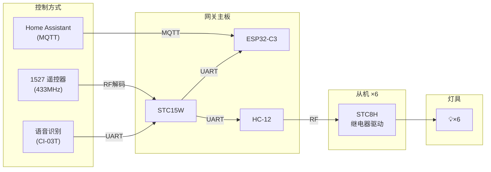

# StarLink Light · 星联灯控

WiFi / RF / 语音三合一多房间智能灯控系统，MQTT 接入 Home Assistant。

## 系统架构



## 项目结构

```
starlink-light/
├── main/                  ESP32-C3 网关固件（ESP-IDF）
│   ├── esp32_gateway_main.c    主程序（1900+行）
│   ├── config.example.h        配置模板
│   └── README.md
├── stc15w/                STC15W 桥接固件（Keil C51）
│   ├── main.c                  主程序
│   └── README.md
├── slave/                 灯控从机固件（Keil C51）
│   ├── main.c                  主程序
│   └── README.md
├── hardware/              PCB 设计文件
│   ├── gateway/              网关主板
│   └── slave/                从机板
├── tools/                 烧录工具
│   ├── slave_flasher_gui.py  GUI 烧录 (主)
│   ├── slave_flasher.py      CLI 烧录
│   ├── addr_manager.py       CLI 地址管理
│   └── STC8H_Burn_Tool.exe   打包 EXE
├── mapper/                1527 映射表管理服务（Python/Node.js）
│   ├── 1527_mapper_server.py   Python版
│   ├── 1527_mapper_server.js   Node.js版
│   ├── 1527_mapper.html        Web管理界面
│   └── README.md
└── ota-server/            HTTP OTA 固件服务器（Python）
    ├── server.py               主服务器
    ├── server_mqtt.py          MQTT推送
    ├── templates/index.html    Web管理界面
    └── README.md
```

## 硬件清单

### 网关主板
| 模块 | 型号 | 功能 |
|------|------|------|
| 主控 | ESP32-C3 | WiFi / MQTT / 配网 / OTA |
| 桥接 | STC15W4K32S4 | 4路串口 + RF解码 + 协议转换 |
| 无线 | HC-12 | 433MHz 无线串口（与从机通信） |
| 语音 | CI-03T | 离线语音识别 |
| RF解码 | 433MHz模块 | 1527遥控器信号解调 |

### 从机（每房间一个）
| 模块 | 型号 | 功能 |
|------|------|------|
| MCU | STC8H1K08 | 串口接收 + 继电器控制 |
| 无线 | HC-12 | 接收网关指令 |
| 执行 | 继电器 | 灯具通断 |

## 部署步骤

### 第一步：编译烧录固件

**ESP32-C3 网关：**
```bash
cd main/
cp config.example.h config.h   # 编辑 config.h 填入你的服务器信息
idf.py build
idf.py flash
```

**STC15W 桥接（Keil C51）：**
1. 打开 `stc15w/starlink-stc15.uvproj`
2. 编译，烧录到 STC15W4K32S4

**STC8H 从机（Keil C51）×6：**
1. Keil 编译一次 `slave/starlink-slave.uvproj`（DEVICE_ADDR 任意值）
2. 用烧录工具自动改地址批量烧录：
   ```bash
   python3 tools/slave_flasher_gui.py   # GUI 版
   # 或直接双击 tools/STC8H_Burn_Tool.exe
   # 或命令行：python3 tools/slave_flasher.py slave/xxx.hex --flash COM3
   ```
> 手动方式：修改 `DEVICE_ADDR` 逐一编译烧录，见 `slave/README.md`

### 第二步：部署服务端

**MQTT Broker（EMQX / Mosquitto）：**
```bash
# 安装 EMQX 或 Mosquitto，创建用户名密码
# 记下 IP、端口、用户名、密码，填入 ESP32 的 config.h
```

**1527 映射表管理（可选）：**
```bash
cd mapper/
cp .env.example .env       # 编辑 MQTT 信息
pip3 install flask paho-mqtt
python3 1527_mapper_server.py   # 端口 18597
```

**OTA 固件服务器（可选）：**
```bash
cd ota-server/
cp .env.example .env       # 编辑 MQTT 信息
python3 server.py               # 端口 15678
```

### 第三步：配网

1. 网关板上电
2. 首次启动（无凭据）自动开 AP `Cloud_Hub` / 密码 `12345678`
3. 手机连接 AP，浏览器访问任意网址自动弹出配网页
4. 输入 WiFi 信息，保存 → 重启 → 自动连接

### 第四步：接入 Home Assistant

设备上电连 WiFi 后自动通过 MQTT 发现，HA 中直接出现 6 个开关实体。

## 控制方式

| 方式 | 说明 |
|------|------|
| **Home Assistant** | MQTT 远程控制，支持自动化 |
| **1527 遥控器** | 433MHz RF 遥控，映射表可远程管理 |
| **CI-03T 语音** | 离线语音指令，无需网络 |

## 通信协议

帧格式 `10 18 [地址] [命令] 18 10`

| 命令 | 值 | 说明 |
|------|-----|------|
| ON | 0x01 | 开灯 |
| OFF | 0x02 | 关灯 |
| QUERY | 0x03 | 查询状态 |
| TOGGLE | 0x04 | 翻转 |
| SET_MAP | 0xA0 | 写入 RF 映射表 |
| GET_MAP | 0xA1 | 读取 RF 映射表 |

| 地址 | 含义 |
|------|------|
| 0x01~0x06 | 6 个房间 |
| 0xFF | 广播（从机执行不回复） |

## MQTT 主题

| 主题 | 用途 |
|------|------|
| `home/sl_cx/state` | 晨曦 |
| `home/sl_wf/state` | 微风 |
| `home/sl_xg/state` | 星光 |
| `home/sl_yy/state` | 月影 |
| `home/sl_yq/state` | 云栖 |
| `home/sl_jy/state` | 霁月 |
| `home/{entity}/command` | 开关命令（ON/OFF） |
| `home/gateway/cmd` | 网关命令（ALLON/ALLOFF/QUERY/UPDATE/RESTART） |
| `home/gateway/1527map` | 映射表读写 |
| `home/gateway/log` | 网关日志 |
| `ota/upgrade/command` | OTA 升级指令 |

## License

MIT
